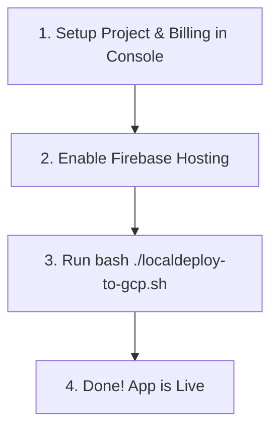

# NoFoodWaste: Deployment Lessons Learned & Happy Path Guide

This document summarizes the technical challenges encountered during the deployment of the **NoFoodWaste** project to Google Cloud Platform (GCP) and Firebase, explains how they were resolved, and outlines a clean **"Happy Path"** for future, seamless deployments.

---

## 1. Summary of Deployment Challenges & Solutions

During our migration from a local SQLite/Podman environment to a stateless Google Cloud Run/Firestore architecture, we solved **7 key technical challenges**:

### Challenge 1: CPU Architecture Mismatch (`exec format error`)
*   **The Problem:** Developing on Apple Silicon (ARM64) macOS builds ARM64 container images by default. Google Cloud Run executes on Intel x86_64 servers. Deploying the ARM64 image caused Uvicorn to crash instantly at startup with `exec format error`.
*   **The Solution:** Added the explicit `--platform linux/amd64` flag to the `podman build`/`docker build` commands. This forces local engines to compile Intel-compatible binaries for the cloud.

### Challenge 2: Stopped Local Container VM
*   **The Problem:** Running local builds failed with `connection refused` socket errors because the Podman virtual machine was stopped.
*   **The Solution:** Added a health check at the start of the script that tests if the container engine is active. If the Podman VM is stopped, the script automatically executes `podman machine start` and waits for it to boot.

### Challenge 3: Silent CLI Hangs (API Activation Prompt Redirections)
*   **The Problem:** The script checked for existing secrets using output redirection (`&>/dev/null`). Because the Secret Manager API was disabled on the new project, `gcloud` silently prompted the user to enable it. The prompt was hidden from view, causing the terminal to hang indefinitely.
*   **The Solution:** Added an explicit, non-interactive API enablement block (`gcloud services enable ... --quiet`) at the very beginning of the deploy cycle, ensuring all services are fully enabled in advance.

### Challenge 4: CORS (Cross-Origin Resource Sharing) Blockage in Production
*   **The Problem:** The FastAPI backend initially only permitted requests from `http://localhost:3000`. Once the frontend went live at `https://[project-id].web.app`, the browser blocked all JavaScript fetches to the Cloud Run API with `<no response> Failed to fetch`.
*   **The Solution:** Resolved by setting up dynamic, secure production CORS rules. The deployment script boots the backend with a wildcard `*` to ensure initial accessibility, but automatically restricts `ALLOWED_ORIGINS` via `gcloud run services update` to the exact deployed frontend URLs (e.g., your custom Firebase domains or frontend Cloud Run service URL) immediately after the frontend goes live.

### Challenge 5: Cloud Billing "Catch-22"
*   **The Problem:** Advanced services like Artifact Registry and Cloud Run require an active Billing Account. Trying to link billing via the CLI failed because the *Cloud Billing API* itself was disabled on the new project (a classic GCP Catch-22).
*   **The Solution:** Removed the command-line billing link and guided the user to link `Mein Rechnungskonto` in the GCP Console in 10 seconds, which automatically initializes the billing subsystem.

### Challenge 6: IAM Eventual Consistency
*   **The Problem:** GCP IAM databases take a few seconds to replicate new service accounts. Running policy bindings immediately after service account creation failed with `Service account does not exist`.
*   **The Solution:** Inserted a 10-second propagation delay (`sleep 10`) immediately after creating the service account to allow Google's global directory to synchronize.

### Challenge 7: Bash Heredoc Indentation Error
*   **The Problem:** Indenting the closing heredoc delimiter `EOF` with spaces inside the `if` block caused bash to miss the closing tag, leading to a syntax error (`unexpected EOF while looking for matching '"'`) at the end of the script.
*   **The Solution:** Moved the `EOF` delimiters to the absolute beginning of the line (0 spaces of indentation).

---

## 2. The "Happy Path" (Future Staging Setup)

If you need to deploy this project or a similar service to a brand-new Google Cloud project in the future, follow this streamlined **Happy Path** to complete the entire deployment in **under 2 minutes**:



### Step 1: Initialize Project & Billing (Browser - 30s)
1.  Go to the [GCP Billing Console Projects page](https://console.cloud.google.com/billing/projects).
2.  Click **Create Project**, name it, and link your billing account (`Mein Rechnungskonto`).

### Step 2: Enable Firebase Hosting (Browser - 30s)
1.  Open the [Firebase Console](https://console.firebase.google.com/).
2.  Click **Add project** and select your newly created GCP project from the dropdown.
3.  Go to the **Hosting** tab (under "Build" / "Hosting und serverlose...") and click the blue **Get Started (Erste Schritte)** button. Click **Next** until you see the dashboard.

### Step 3: Run the Script (Terminal - 60s)
1.  Open your terminal, make sure your container engine is running, and authenticate:
    ```bash
    gcloud auth login
    npx firebase-tools login
    ```
2.  Set the active project to your new project ID:
    ```bash
    gcloud config set project [YOUR_PROJECT_ID]
    ```
3.  Run the automated deployment script:
    ```bash
    bash ./localdeploy-to-gcp.sh
    ```
4.  Type `y` to confirm, and select `1` for Firebase Hosting when prompted at the end.

**Done!** Your backend, database, secrets, service accounts, and frontend are deployed and fully connected under a secure, globally distributed architecture!
