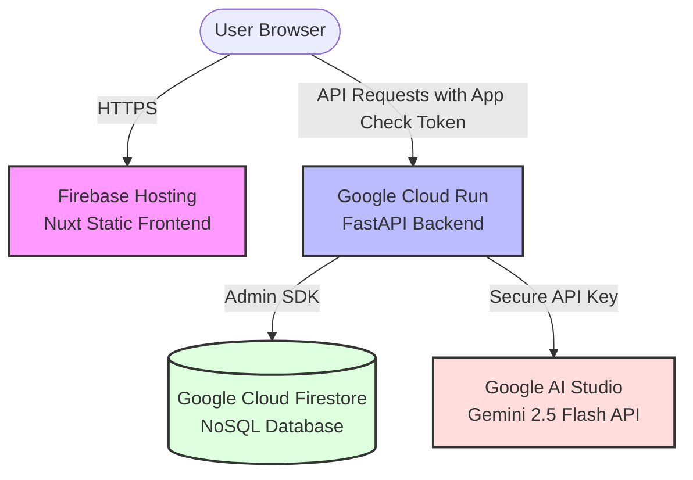

# Secure & Cost-Effective Google Cloud Hosting Proposal

This proposal outlines a highly secure, modern, and virtually free (**0.00 CHF / month**) hosting architecture within the **Google Cloud Platform (GCP)** and **Firebase** ecosystem for the **NoFoodWaste** project.

By moving from a stateful local SQLite setup to a stateless Google Cloud Run deployment backed by **Google Cloud Firestore**, we achieve enterprise-grade security and reliability with zero maintenance overhead.

---

## Architecture Overview

The architecture is divided into three serverless, fully managed components that integrate seamlessly:

1. **Frontend:** Nuxt static site hosted on **Firebase Hosting** (fast, global CDN, completely free).
2. **Backend:** FastAPI Docker container hosted on **Google Cloud Run** (scales to 0, completely managed, extremely generous free tier).
3. **Database:** **Google Cloud Firestore** in Native/NoSQL mode (serverless, always-free tier up to 50k reads/day).
4. **AI Integration:** **Gemini 2.5 Flash API** (via Google AI Studio, highly cost-effective or free under developer limits).

---

## 4 Layers of Native GCP Abuse & Cost Protection

To protect the serverless backend from malicious automated traffic, denial of service (DDoS), and runaway LLM costs (Financial Denial of Service - FDoS), we implement **four native, zero-cost security layers** (avoiding expensive enterprise solutions like Google Cloud Armor).

### Layer 1: Firebase App Check (Bot & Script Prevention)
> [!IMPORTANT]
> This is our strongest line of defense against API abuse.

App Check protects custom backend endpoints (Cloud Run) by ensuring that **only requests originating from your genuine Nuxt web application** are accepted.

*   **How it works:** Nuxt uses the Firebase App Check SDK (powered by **reCAPTCHA v3**) to transparently verify that a real human is using the official site. It obtains a temporary cryptographic token.
*   **Backend Validation:** The frontend sends this token in the `X-Firebase-AppCheck` header. The FastAPI backend validates this token using the Firebase Admin SDK.
*   **Result:** Any direct script, bot, curl request, or Postman call attempting to spam the `/recipes/generate` endpoint will be instantly rejected with `401 Unauthorized` without calling the LLM.
*   **Cost:** **Free** (reCAPTCHA v3 is free for up to 1 million verifications per month).

### Layer 2: Cloud Run Auto-Scaling Capping (Compute Cost Protection)
To prevent unexpected CPU/RAM charges from traffic spikes:
*   **Instance Cap:** Set the maximum scaling limit to **1 or 2 instances** (`max-instances = 2`).
*   **Concurrency:** Keep the default target concurrency high (e.g., up to 80 concurrent requests per container).
*   **Result:** Even during a major DDoS attempt, Google Cloud will never spin up hundreds of virtual machines. The system caps itself, processing requests within the limits and dropping excess requests gracefully, keeping your monthly bill at **0.00 CHF**.

### Layer 3: Google AI API Key Restrictions & Quotas (LLM Cost Protection)
To protect your Gemini LLM integration:
*   **API Restriction:** Restrict the Google AI API key so it **only** has permissions to call the `Generative Language API` (Gemini).
*   **Quota Limits:** Configure native API rate limits in the Google AI Studio console (e.g., max 15 requests per minute, max 1,500 requests per day).
*   **Result:** Even if an attacker somehow bypasses Layer 1, they cannot run up a massive LLM bill because the API key will automatically rate-limit itself at the Google infrastructure level.

### Layer 4: Google Cloud Billing Budgets & Alerts (The Ultimate Safety Net)
*   **Budget Limit:** Configure a hard billing budget of **5.00 CHF / month** in the GCP Billing Console.
*   **Alert Thresholds:** Set up automated email and SMS alerts when spending reaches 50% (2.50 CHF), 90% (4.50 CHF), and 100% (5.00 CHF).
*   **Result:** You have complete visibility and a guaranteed alarm system, ensuring no surprise bills.

---

## Dual-Database Provider Strategy

To maintain maximum flexibility and ease of development, the backend will implement a **switchable Database Provider pattern**:

| Environment | Provider (`DB_PROVIDER`) | Storage Mechanism | Benefits |
| :--- | :--- | :--- | :--- |
| **Local Development** | `sqlite` | Local file `food_waste.db` | Works offline, zero cloud setup, fast iteration. |
| **Google Cloud (Production)** | `firestore` | Cloud Firestore (NoSQL) | 100% stateless backend, no disk mounts, zero cost. |

This architecture allows developers to run `docker-compose up` locally without any internet connection, and deploy the exact same codebase to Google Cloud Run where it seamlessly connects to Firestore!

---

## Implementation & Deployment Roadmap

1.  **Code Refactoring:**
    *   Refactor `database.py` to support `DatabaseProvider` interface with `SQLiteProvider` and `FirestoreProvider` concrete classes.
    *   Inject the provider based on the `DB_PROVIDER` environment variable.
2.  **Local Verification:**
    *   Test both SQLite and Firestore local connections.
3.  **Firebase & GCP Setup:**
    *   Create a free Google Cloud / Firebase project.
    *   Enable **Cloud Firestore** in Native mode.
    *   Enable **Firebase App Check** for the project.
4.  **Deployment:**
    *   Deploy the static Nuxt frontend to **Firebase Hosting**.
    *   Build and deploy the FastAPI backend to **Google Cloud Run** using the provided `Dockerfile`.
    *   Link GCP Service Accounts to grant the Cloud Run instance secure, passwordless access to Firestore.
